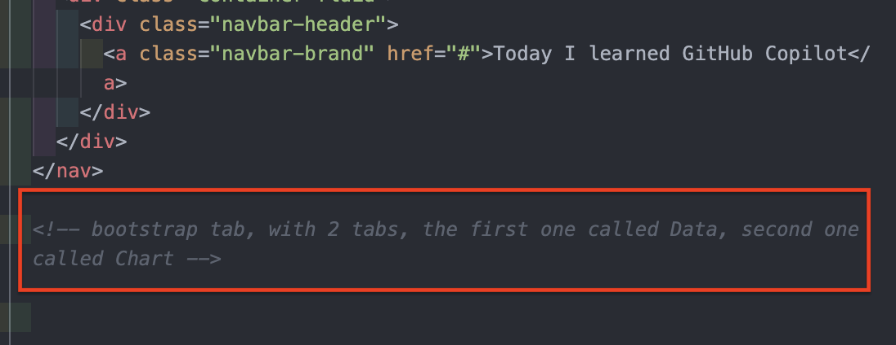
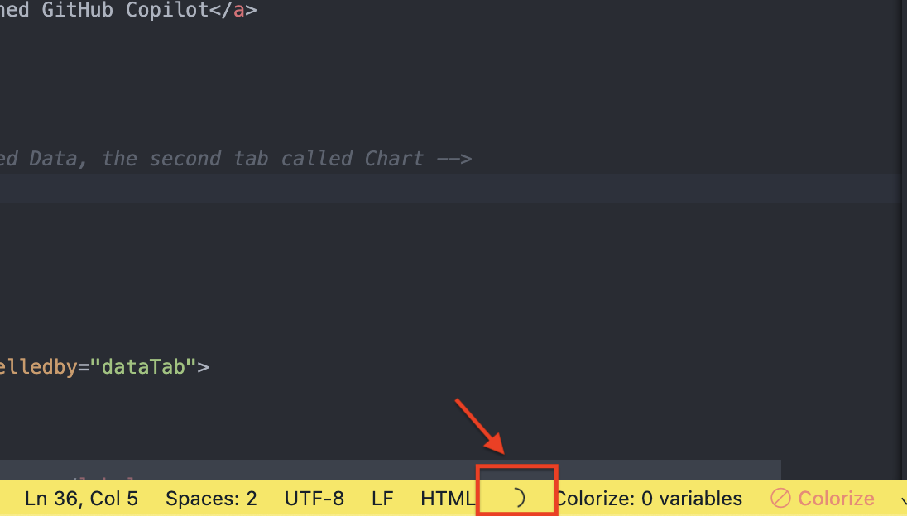
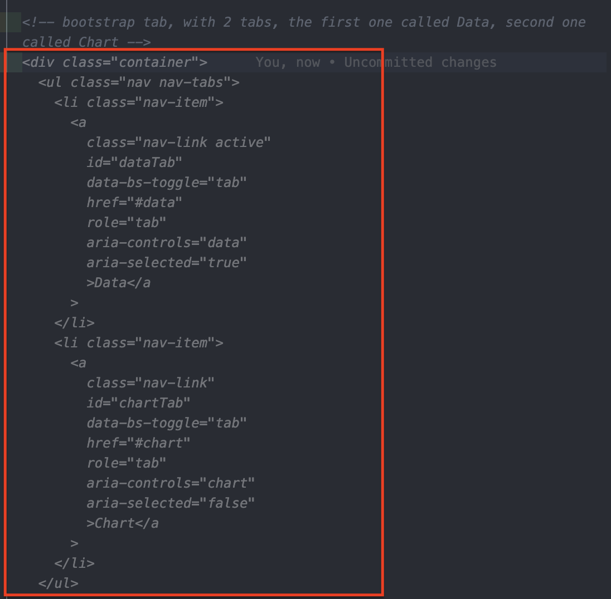
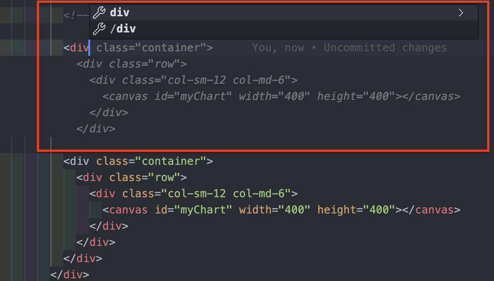

Can GitHub Copilot be my AI pair programmer?

## What is it

I have heard a lot of noise recently about [GitHub Copilot](https://github.com/features/copilot) being `your AI pair programmer`. Being a programmer who loves pairing, I was curious to test this out to see if the fuss was correct.

Following [this course on Udemy](https://www.udemy.com/course/github-copilot/), I managed to use GitHub Copilot to create a simple web app that allows users to input income and expenses for each month, plot it to a bar chart, then download that chart as an image. It took me around 3 hours in total to create this web app.

This repository has all the code and prompts that I used to create the web app.

## How to view the web app

1. Clone this repository
1. Open the [index.html](./index.html) in a browser

## How to setup GitHub Copilot in VS Code

1. Install [VS Code](https://code.visualstudio.com/download). This is an IDE (integrated development environment) which allows you to write code.
1. After installing VS Code, open `Extensions` tab and add [GitHub Copilot](https://marketplace.visualstudio.com/items?itemName=GitHub.copilot). This extension provides autocomplete-style suggestions as you code.
1. Also add [GitHub Copilot Labs](https://marketplace.visualstudio.com/items?itemName=GitHub.copilot-labs), a companion extension to GitHub Copilot. This extension provides more advanced and experimental features in the sidebar of VS Code e.g. explaining what the code does, translating a code to a certain language like Python etc.

> **_NOTE:_** You need to either create or login to a **GitHub account**. You also need to have a **subscription to GitHub Copilot** in order to use it. In my case, I subscribed to the free trial which, at the time of writing this ReadMe, was for 30 days. Within this period you can cancel any time to avoid charges.

## How to use GitHub Copilot in VS Code

GitHub Copilot is an AI powered coding assistant that offers autocomplete-style suggestions as you code. There are two ways to trigger suggestions:

- By **writing a comment** (**_a prompt_**) describing what you want the code to do, or
- By starting to **write the code** you want to use.

GitHub Copilot analyses the context and comments in the file you are editing, as well as related files, and provides suggestions in the form of a single line of code or even a block of code.

### Trigger GitHub Copilot suggestions by writing a comment

To trigger a suggestion, just start typing a comment (acting as a prompt) **describing what the piece of code does**. For example, I wrote the below comment and press `Enter` at the end of the comment. Pressing `Enter` signifies to Copilot that you want to get suggestions.

```
<!-- bootstrap tab, with 2 tabs, first one called Data, second one called Chart -->
```



> **_NOTE:_** A good prompt is crucial to make Copilot return more accurate results. You should write the prompt **describing exactly what the code does** rather than describing what you want.

Example of a **_good_** prompt (which explains what the code does):

```
<!-- bootstrap tab, with 2 tabs, first one called Data, second one called Chart -->
```

Example of a **_bad_** prompt (which explains what you want Copilot to do):

```
<!-- Create a bootstrap tab, with 2 tabs, first one called Data, second one called Chart -->
```

After pressing `Enter`, just wait for a moment and you will notice at the status bar of your VS Code, Copilot is processing your prompt.



After Copilot is done processing your comments, it displays the result to your screen. If you're happy with the suggestion, click `Tab` to accept it. You can look at other suggestions if there is more than one.



### Trigger GitHub Copilot suggestions by writing the code

Another way of triggering suggestions is quite simple, just start writing the code and Copilot will give suggestions on the fly similar to [IntelliSense](https://code.visualstudio.com/docs/editor/intellisense). To accept a suggestion, similar to how I explained above, press `Tab`.



## My closing thoughts on using GitHub Copilot

I have a lot of thoughts and opinions about Copilot. However, I will refrain from listing them here so you do not get _spoilers_ and can try Copilot without any bias. I will add a link to my blog that I wrote about my opinions. Stay tuned!!!
